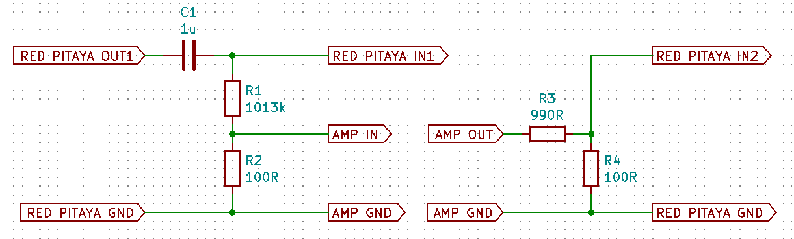
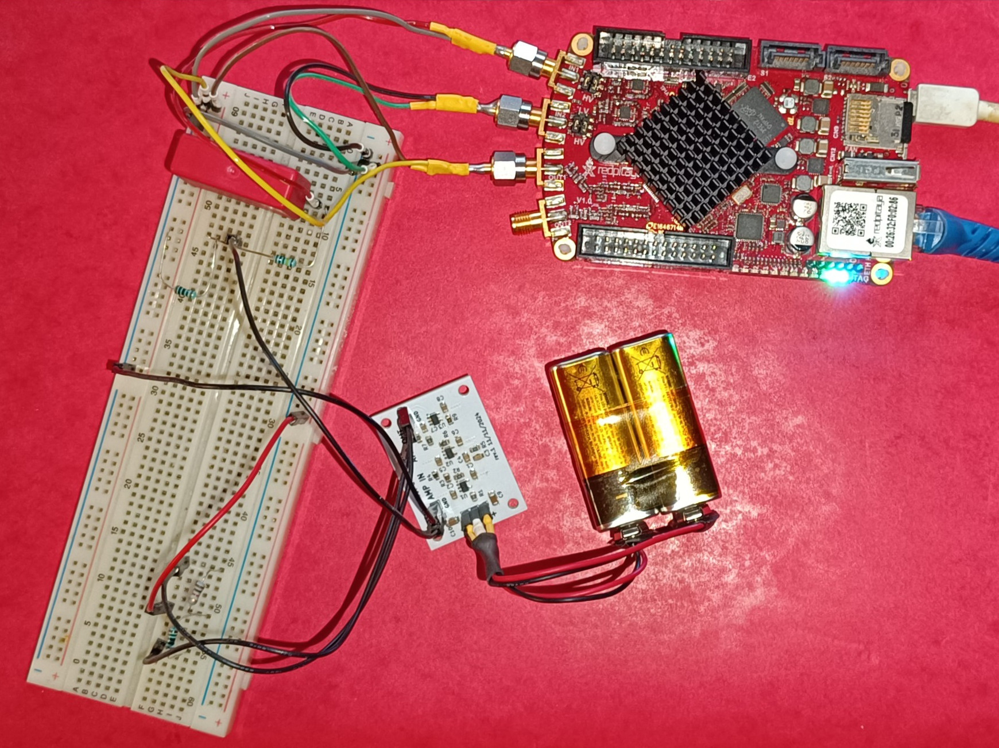
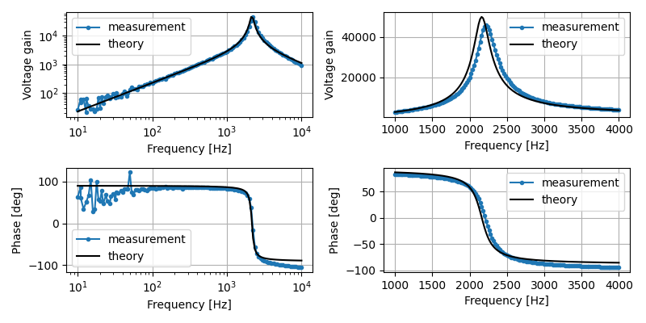

# 07.12.2024

### Measurement of test amplifier board gain

Use red pitaya to measure voltage at the board's input and output for a range of frequencies. Output of red pitaya's sine generator is dc-blocked by a 1 microfarad capacitor, then voltage-divided by a factor of about 10,000 with a resistive divider. The attenuated voltage is then passed to the input of the amplifier. The amplified voltage is further divided by a factor of about 10.

The voltages before the input divider and after the output divider are measured by the red pitaya. The setup is summarized here:

The gain is calculated by fitting the amplitude, phase and frequency of the input voltage and the amplitude and phase of the output voltage (while the frequency is fixed to be equal to that of the input signal), then dividing the ratio of the voltages by the predicted combined attenuation of the voltage dividers:

### Measurement of noise power spectral density

- Record 100 waveforms with the red pitaya's input channel 1 shorted to ground (with an SMA short).
- Record 100 waveforms with the red pitaya's input channel 1 shorted to ground (with the wires used otherwise to connect the amplifier, but shorted together).
- Record 100 waveforms with the red pitaya's input channel 1 connected to the amplifier's output while the input is shorted to ground.
- Record 100 waveforms with the red pitaya's input channel 1 connected to its output channel 1 set to a 1kHz 2Vpp sine wave.

Analysis to be done.
